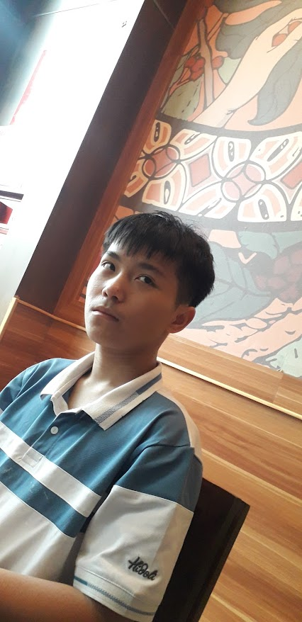

# 🎨 Thiện Đồ Họa – Nghệ sĩ đầy mâu thuẫn trong giới thiết kế trẻ

## 📌 Giới thiệu

**"Thiện Đồ Họa"** là một dự án web vinh danh **Nguyễn Đức Thiện** – chàng trai trẻ mang trong mình đam mê mãnh liệt với thiết kế, sáng tạo và nghệ thuật số. Với khả năng cảm màu tốt, khiếu thẩm mỹ độc đáo và tinh thần tự do, anh là linh hồn sáng tạo của cả nhà.

Trang web không chỉ là một hồ sơ cá nhân, mà còn là nơi truyền cảm hứng cho thế hệ trẻ yêu nghệ thuật, phản ánh:
- Quá trình học tập và phát triển trong lĩnh vực thiết kế đồ họa.
- Phong cách sống năng động, cá tính và giàu bản sắc riêng.
- Sự ủng hộ và tự hào từ gia đình dành cho Thiện.

## 💻 Công nghệ sử dụng

- HTML5 + CSS3 thuần
- Thiết kế responsive đơn giản, dễ hiển thị trên mọi thiết bị
- Hiệu ứng nhẹ nhàng, không làm rối bố cục như tâm trí Thiện lúc thiếu ngủ
- Ảnh được sử dụng: `thien-do-hoa-1.jpg`, `thien-do-hoa-2.jpg`
- Âm thanh được sử dụng: `thien-do-hoa-1.mp3`, `thien-do-hoa-2.mp3`

## 🧠 Mục tiêu dự án

- Ghi nhận và lan tỏa hình ảnh một nghệ sĩ trẻ có tài và... nhiều tật.
- Giúp bạn bè, người thân hiểu và "sống chung với Thiện" một cách dễ thở hơn.
- Làm ví dụ mẫu cho những hồ sơ hài hước – nhưng chứa đựng thông điệp thật.

## 📷 Giao diện

Trang web chia thành 2 phần chính:

1. **Giới thiệu** – Tiểu sử, tài năng, thói quen và câu chuyện về Thiện.
2. **Đánh giá** – Ưu điểm và khuyết điểm của Thiện.
3. **Lời khuyên** - Nhắc nhở và khuyên nhủ Thiện thay đổi.

## 📁 Cấu trúc thư mục

~~~bash
thien-do-hoa/
├── index.html           # Trang chính
├── style.css            # Giao diện được cá nhân hóa theo phong cách của Thiện
├── thien-do-hoa-1.jpg   # Ảnh chân dung Thiện Đồ Họa
├── thien-do-hoa-2.jpg   # Ảnh chân dung Thiện Đồ Họa
├── thien-do-hoa-1.mp3   # Đoạn ghi âm Thiện Đồ Họa
├── thien-do-hoa-2.mp3   # Đoạn ghi âm Thiện Đồ Họa
└── README.md            # Tập tin giới thiệu dự án
~~~

## ▶️ Vào trang web
Bạn có thể vào trang web mà không cần cài gì cả 👉[Vào trang web tại đây](https://tri1407.github.io/Thien-Do-Hoa)
